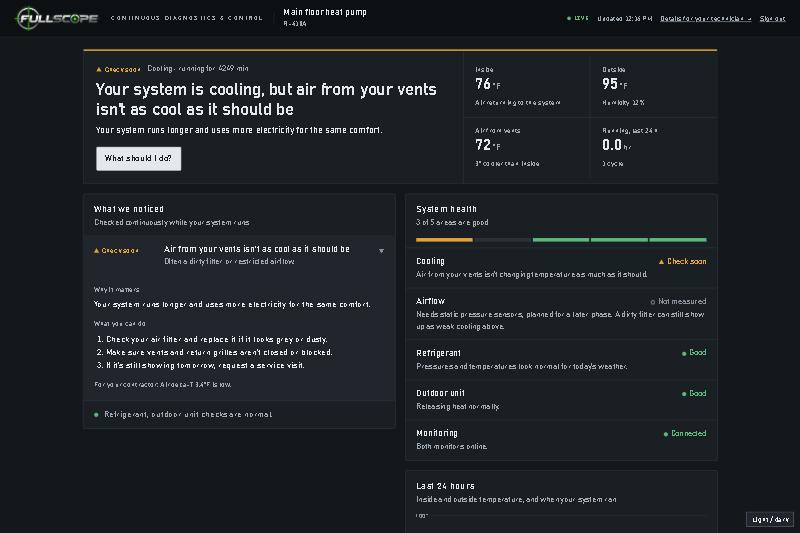
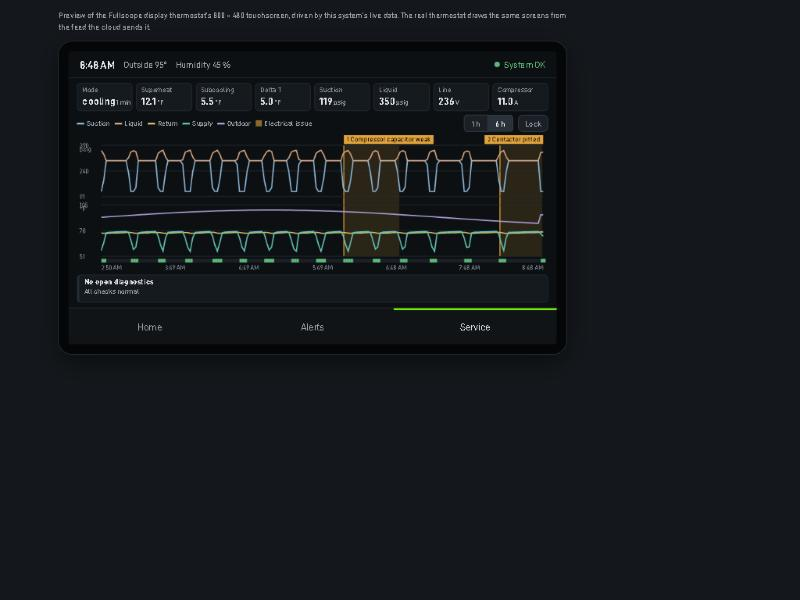

# Fullscope: continuous HVAC diagnostics

Fullscope monitors a home's heat pump or air conditioner continuously, the way a technician
would with gauges on it, and tells the contractor and the homeowner when something is going
wrong, before it becomes a no-cool call.

Two small ESP32 monitors sit on the equipment:
- **Outdoor:** refrigerant pressures, line temperatures, outdoor air.
- **Indoor:** supply and return air.

Both read which calls the thermostat is making. A cloud service turns their readings into
superheat, subcooling, delta-T and other checks, and shows them in a web app with two views:
- a **technician view** with live trends and diagnostics;
- a **homeowner view** in plain language.



## Status (October 2026)

| Part | State |
|---|---|
| Node firmware (outdoor + indoor) | v0.2.0 built; both dev boards online running 0.1.0, 0.2.0 goes on at board bring-up |
| Carrier boards (rev A, KiCad) | Arrived from JLCPCB; being assembled for bring-up |
| Cloud + web app | Working locally (SQLite) and in Docker (TimescaleDB); production setup ready to deploy |
| Contractor demo | Seven scripted homes for customer interviews |
| Display thermostat (add-on) | Cloud side, screen and firmware written and tested on the PC; no hardware yet |
| Electrical module (add-on) | Diagnostics written; no hardware yet |
| 900 MHz LoRa radio | Designed and written (nodes, gateway, thermostat as gateway); waiting on a range test |

The full plan is in [project-files/1-plans/roadmap.md](project-files/1-plans/roadmap.md).

## How it fits together

```
 outdoor node ─┐                       ┌─ web app: homeowner + technician views, fleet page
 indoor node  ─┼─ WiFi (or LoRa via ─▶ MQTT broker ─▶ cloud: ingest → diagnostics → alerts
 thermostat   ─┘   a gateway)                          (FastAPI, SQLite / TimescaleDB)
                                                       └─ email alerts, thermostat config + display feed
```

- The nodes publish JSON on `hvac/<site>/<node>/{telemetry,status,reply}` and take
  calibration commands on `.../cmd`.
- The cloud judges each check only when it can be judged, for example refrigerant after
  10 minutes of steady running. A problem that lasts 5 minutes raises an alert.
- The optional display thermostat runs all its control and safety logic on the device itself,
  so heating and cooling never depend on the internet.

## What's where

| Folder | What it is |
|---|---|
| [hvac-firmware](hvac-firmware) | ESP32 firmware for the outdoor and indoor nodes (PlatformIO) |
| [hvac-cloud](hvac-cloud) | Cloud: MQTT ingest, diagnostics, alerts, REST API, the Fullscope web app, contractor demo, Docker / production setup ([DEPLOY.md](hvac-cloud/DEPLOY.md)) |
| [hvac-monitor-app](hvac-monitor-app) | PC dashboard for bench work with one system |
| [hardware](hardware) | Rev A carrier boards (KiCad, fabrication files, schematic PDFs) |
| [docs](docs) | Wiring schematics and carrier-board notes (HTML) |
| [thermostat](thermostat) | Display thermostat: design ([README](thermostat/README.md)) and firmware for the Waveshare ESP32-S3 4.3" board |
| [electrical](electrical) | Electrical monitoring module: design and diagnostic rules |
| [radio](radio) | 900 MHz LoRa: FCC research, frame format, Python reference, C++ library, gateway, range test |
| [design](design) | Fullscope design system, mockups and logos |
| [project-files](project-files) | Roadmap, contractor interview kit, parts list, screenshots, branding |
| [_archive](_archive) | Early prototypes, kept for reference |

[CLAUDE.md](CLAUDE.md) is the detailed, up-to-date technical overview of the whole project.

## Running it

**On Windows, the quick way:** `start-hvac.bat` (the Desktop "HVAC Monitor" shortcut) starts
three things:
- the MQTT broker;
- the PC dashboard on http://localhost:8080;
- the cloud with its web app on http://localhost:8000.

**Cloud only, for development:**

```powershell
cd hvac-cloud
python -m venv .venv
.venv\Scripts\python.exe -m pip install -r requirements-dev.txt
.venv\Scripts\python.exe -m pytest -q
```

Then follow [hvac-cloud/README.md](hvac-cloud/README.md) to create an account and system and
start the ingest worker and API.

**The contractor demo:** after the cloud is running, `hvac-cloud\start-demo.bat` creates a demo
contractor account with seven homes acting out common faults. The sign-ins are saved to
`hvac-cloud\demo-login.txt`.

**Firmware:** copy `include/config.example.h` to `include/config.h`, fill in WiFi and the
broker, then build and flash with PlatformIO:

```powershell
cd hvac-firmware
pio run -e outdoor -t upload
```

See [hvac-firmware/README.md](hvac-firmware/README.md) for calibration and the command list.

## Tests

| Where | Command | What it checks |
|---|---|---|
| `hvac-cloud` | `.venv\Scripts\python.exe -m pytest -q` | Cloud, diagnostics, alerts, accounts, thermostat, demo |
| `thermostat/firmware` | `pio test -e native` | The thermostat's C++ controller replayed against the Python reference |
| `radio/lora` | `pio test -e native` | LoRa frames and encryption, byte for byte against the Python reference |
| `radio` | `.venv\Scripts\python.exe -m pytest -q` | The Python frame format reference |

The native PlatformIO tests need a host C++ compiler, for example MSYS2 `ucrt64` on the PATH.

## Safety

The monitors are low-voltage (24 VAC from the equipment's control circuit). Never connect a
board to USB and 24 VAC at the same time. The electrical module and the thermostat touch more
than that, and their READMEs cover what is needed before either goes near real equipment
(isolation, qualified installation, UL 60730 / 61010). Readings are diagnostic inferences, not
confirmed diagnoses.


